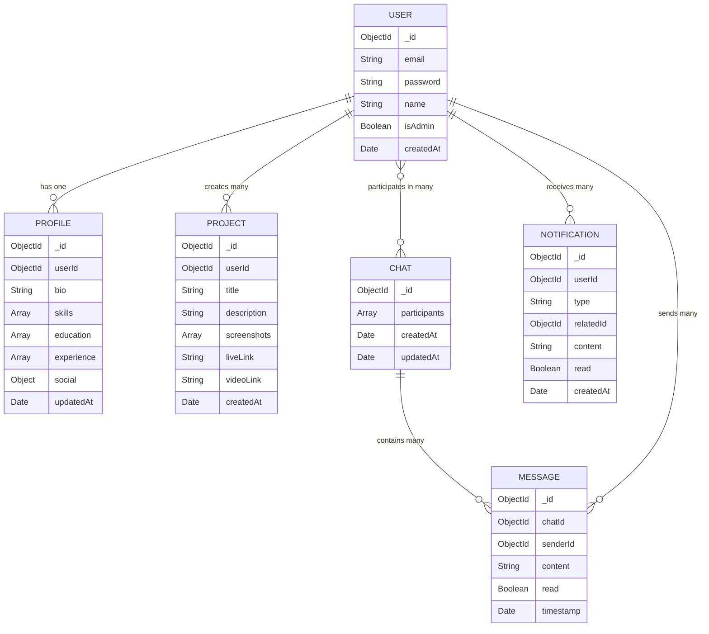

# FxE Entity Relationship Diagram

This document provides an overview of the database schema and entity relationships for the FxE platform.

## Entity Relationship Diagram

## Entity Descriptions

### User
- Central entity storing user authentication and basic info
- Relationships:
  - One User has one Profile
  - One User can create many Projects
  - One User can participate in many Chats
  - One User can send many Messages
  - One User can receive many Notifications

### Profile
- Stores detailed user information
- Relationships:
  - One Profile belongs to one User

### Project
- Represents user portfolios and work samples
- Relationships:
  - One Project belongs to one User (creator)

### Chat
- Represents conversations between users
- Relationships:
  - One Chat involves multiple Users
  - One Chat contains many Messages

### Message
- Individual communications within a Chat
- Relationships:
  - One Message belongs to one Chat
  - One Message is sent by one User

### Notification
- System or user-triggered notifications
- Relationships:
  - One Notification is received by one User
  - Notifications can relate to Projects, Messages, or other entities

## Data Flow

1. Users register and create profiles
2. Users can upload projects to their portfolios
3. Users can browse other users' projects
4. Users can initiate chats with other users
5. Users receive notifications for various activities

## Schema Design Considerations

### Normalization
- The schema follows MongoDB best practices with appropriate references between collections
- Some denormalization is used where frequent joins would be inefficient

### Indexing Strategy
- Indexes on userId fields for faster lookups
- Indexes on frequently queried fields like email
- Compound indexes on chat participants for efficient chat lookup

### Performance Considerations
- Chat messages may need sharding for high-volume applications
- Consider time-based partitioning for notifications and messages 